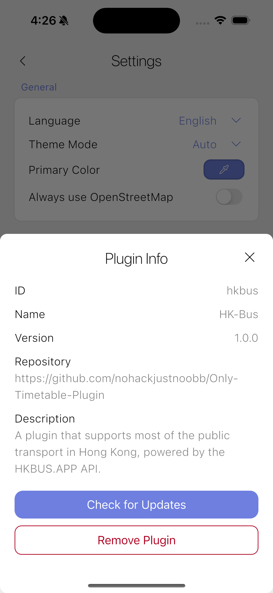

<div align="center">

# Only Timetable

[](https://github.com/nohackjustnoobb/Only-Timetable/actions/workflows/main.yml)
[](https://github.com/nohackjustnoobb/Only-Timetable/blob/master/LICENSE)
[](https://github.com/nohackjustnoobb/Only-Timetable/releases)

</div>

<p align="center">
  <b>🌐 Visit the Plugin Marketplace & Website: <a href="https://nohackjustnoobb.github.io/Only-Timetable-Website/">Here</a></b>
</p>

Only Timetable is a flexible, plugin-based timetable application for bus and other public transport systems. The name "Only Timetable" reflects the app's purpose: it is the **ONLY** app you need for bus and public transport timetables, and it is focused **ONLY** on providing timetable information. There are no distractions—just the essential features for managing and viewing transport schedules. The core app does not include any routes or ETA data by default; all transport information is provided via plugins. This design allows support for any bus company or region simply by adding or developing the appropriate plugin.

## Features

1. **Plugin-based, Extensible & Marketplace:** Easily extend support to new transport providers or regions by adding plugins. Discover, install, and manage plugins directly within the app using the built-in Plugin Marketplace. The app is designed to be minimal and adaptable, with all timetable data provided by plugins, and the marketplace makes it easy to find and update plugins for any transport provider or region.

<p align="center">
  
  
  
</p>

2. **Modern, Customizable UI:** Enjoy a beautiful, modern interface that automatically adapts to your device's light or dark theme. Personalize your experience by choosing your preferred theme color with a simple color picker.

<p align="center">
  
  
  
</p>

3. **Multilanguage & Easy to Use:** Use the app in your preferred language—Only Timetable supports multiple languages, making it accessible worldwide. The intuitive design ensures anyone can get started quickly, focusing on simplicity and essential features for managing and viewing transport schedules.

<p align="center">
  
  
  
</p>

## Download

### Android

- **AAB (Google Play format):** [app-release.aab](https://github.com/nohackjustnoobb/Only-Timetable/releases/latest/download/app-release.aab)
- **APK (Direct install):** [app-release.apk](https://github.com/nohackjustnoobb/Only-Timetable/releases/latest/download/app-release.apk)

You can install the APK directly on your device, or use the AAB for distribution via Google Play or compatible stores.

### iOS

- **IPA (Sideload only, not tested):** [app-release.ipa](https://github.com/nohackjustnoobb/Only-Timetable/releases/latest/download/app-release.ipa)

> ⚠️ The IPA file is **not tested** and can only be installed via sideloading (e.g., using AltStore, Sideloadly, or Xcode). For most users, it is easier and more reliable to build and install the app yourself using Flutter:
>
> ```sh
> flutter run --release
> ```
>
> This will build and install the app directly to your connected iOS device.

For all available downloads, visit the [Releases Page](https://github.com/nohackjustnoobb/Only-Timetable/releases).

## Getting Started

> **Note:** If you are running the app on an iOS 18.5 simulator, the `flutter_inappwebview` plugin may cause the app to crash. This issue does not occur on real devices or other iOS versions. If you encounter crashes, try using a different simulator version or a physical device.

1. **Clone the repository:**

   ```sh
   git clone https://github.com/nohackjustnoobb/Only-Timetable.git
   cd Only-Timetable
   ```

2. **Install dependencies:**

   ```sh
   flutter pub get
   ```

3. **Run the app:**

   ```sh
   flutter run
   ```

## Plugin Development

To develop a plugin for Only Timetable, use the official plugin template:

[Only-Timetable-Plugin-Template](https://github.com/nohackjustnoobb/Only-Timetable-Plugin-Template)

The template repository contains detailed instructions and boilerplate code to help you get started quickly. Follow the steps in the template's README to create and publish your own plugin for any transport provider or region.

Plugins can be distributed and discovered through the built-in Plugin Marketplace in the app. If you want your plugin to be listed in the marketplace, submit a pull request to [Only-Timetable-Website](https://github.com/nohackjustnoobb/Only-Timetable-Website) with your plugin links.
