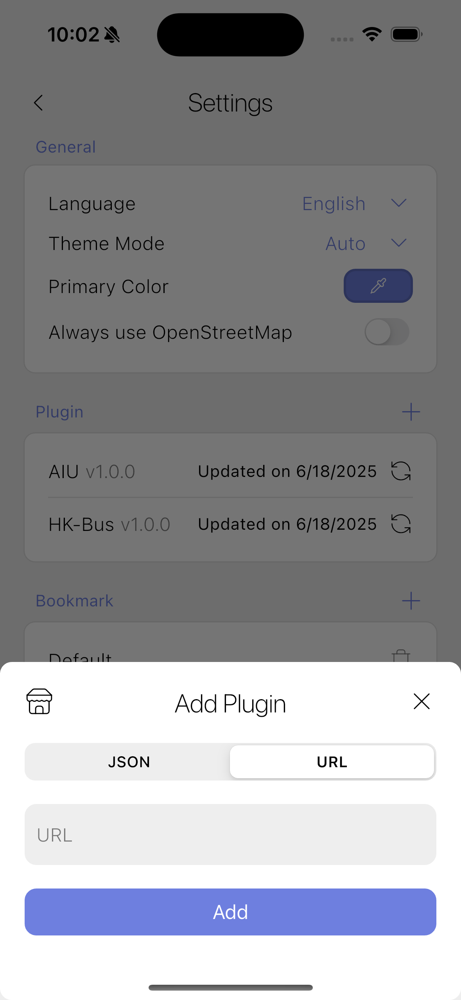
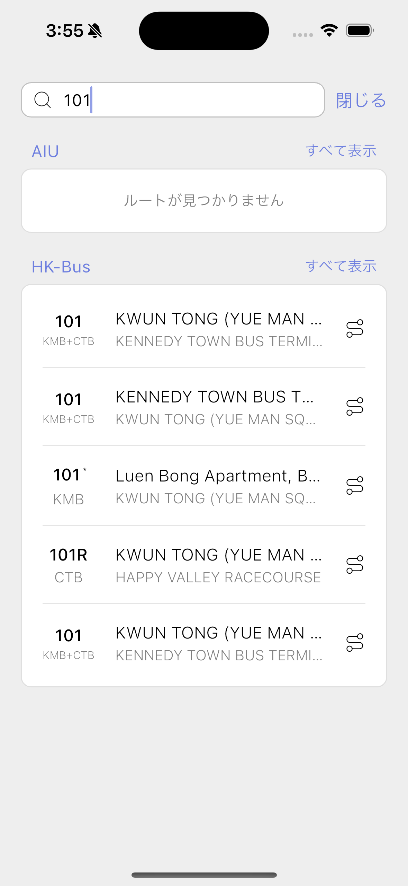
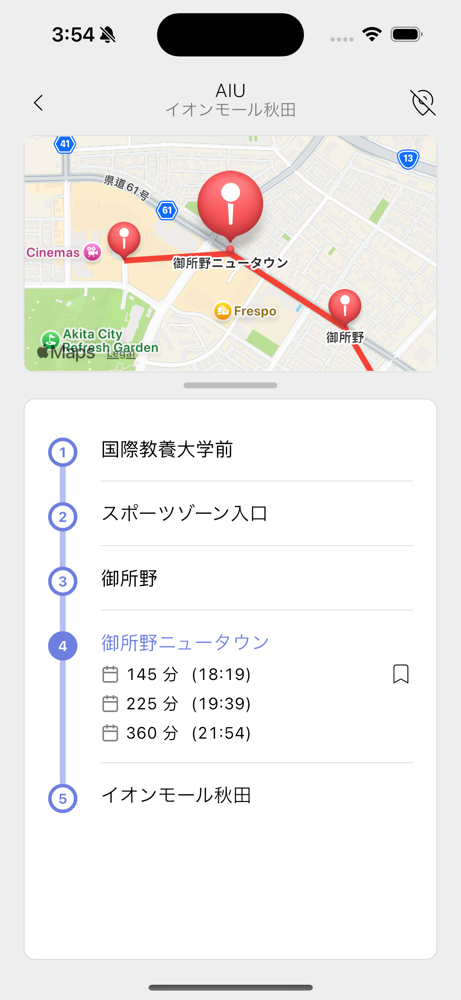

# Only Timetable

Only Timetable is a flexible, plugin-based timetable application for bus and other public transport systems. The name "Only Timetable" reflects the app's purpose: it is the **ONLY** app you need for bus and public transport timetables, and it is focused **ONLY** on providing timetable information. There are no distractions—just the essential features for managing and viewing transport schedules. The core app does not include any routes or ETA data by default; all transport information is provided via plugins. This design allows support for any bus company or region simply by adding or developing the appropriate plugin.

## Features

1. **Plugin-based & Extensible:** Easily extend support to new transport providers or regions by adding plugins. The app is designed to be minimal and adaptable, with all timetable data provided by plugins.

<p align="center">
  
  
</p>

2. **Modern, Customizable UI:** Enjoy a beautiful, modern interface that automatically adapts to your device's light or dark theme. Personalize your experience by choosing your preferred theme color with a simple color picker.

<p align="center">
  
  
  
</p>

3. **Multilanguage & Easy to Use:** Use the app in your preferred language—Only Timetable supports multiple languages, making it accessible worldwide. The intuitive design ensures anyone can get started quickly, focusing on simplicity and essential features for managing and viewing transport schedules.

<p align="center">
  
  
  
</p>

## Getting Started

1. **Clone the repository:**

   ```sh
   git clone https://github.com/nohackjustnoobb/Only-Timetable.git
   cd Only-Timetable
   ```

2. **Install dependencies:**

   ```sh
   flutter pub get
   ```

3. **Run the app:**

   ```sh
   flutter run
   ```

## Plugin Development

To develop a plugin for Only Timetable, use the official plugin template:

[Only-Timetable-Plugin-Template](https://github.com/nohackjustnoobb/Only-Timetable-Plugin-Template)

The template repository contains detailed instructions and boilerplate code to help you get started quickly. Follow the steps in the template's README to create and publish your own plugin for any transport provider or region.
